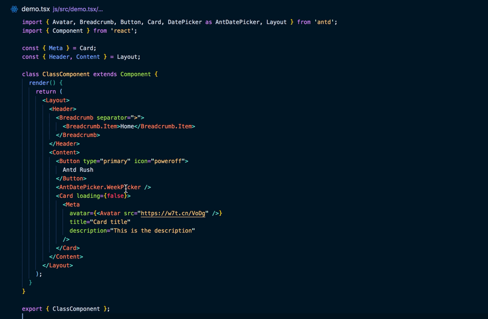
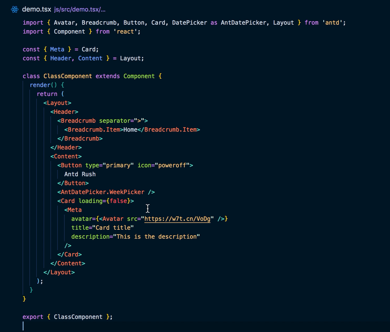
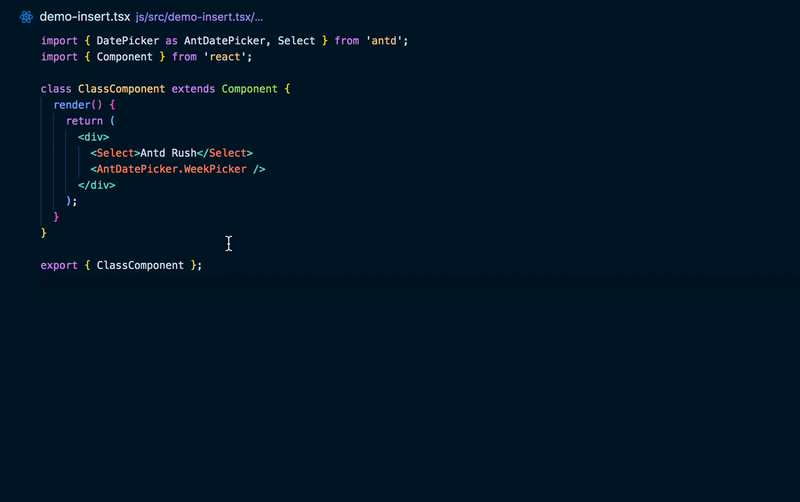

<p align="center">
  <a href="https://github.com/fi3ework/vscode-antd-rush">
    
  </a>
</p>
<h1 align="center">Antd Rush</h1>
<div align="center">

Rush to Ant Design in VS Code

<p align="center">
<a href="https://marketplace.visualstudio.com/items?itemName=fi3ework.vscode-antd-rush">

</a>
<a href="https://marketplace.visualstudio.com/items?itemName=fi3ework.vscode-antd-rush">

</a>
<a href="https://marketplace.visualstudio.com/items?itemName=fi3ework.vscode-antd-rush">

</a>
<a href="https://marketplace.visualstudio.com/items?itemName=fi3ework.vscode-antd-rush">

</a>
<a href="https://github.com/fi3ework/vscode-antd-rush/actions?query=workflow%3ATest">

</a>
</p>

</div>

[Download from Visual Studio Marketplace](https://marketplace.visualstudio.com/items?itemName=fi3ework.vscode-antd-rush)

English | [中文](./README-zh_CN.md)

## Feature

- 💬 Show documentation for Ant Design component and props
- ⚡️ Insert method handler automatically
- ✨ Easy to upgrade with Ant Design
- 🌐 Support Chinese and English documentation

## Caveat

- Currently used version of the Ant Design documentation is **3.26.4**
- `@types/react` is required to be installed in the project

## Usage

### Component props table hover hint

- Hover on component and get component documentation hint
- Jump to Ant Design documentation page via link



### Props detail hover hint



### Auto insert method handler

- Trigger `!` to auto insert handler with prefix `#` (default `handle`, it's configurable)
- Trigger `#` to insert handler after inquiry input
- No add TypeScript type annotation for now
- class component insertion template is

```jsx
this.handleMethod = () => {}
```

- functional component insertion template is

```jsx
const handleMethod = useCallback(() => {})
```



## Contributing

See [CONTRIBUTING](https://github.com/fi3ework/vscode-antd-rush/blob/master/CONTRIBUTING.md)

## Roadmap

See [#1](https://github.com/fi3ework/vscode-antd-rush/issues/1)

## License

MIT
